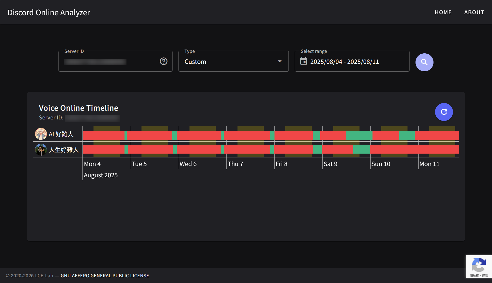

# Analysis_Bot_Web



Check out the backend repo [here](https://github.com/LCE-Lab/Analysis_Bot).

## Chart

- Powered by [vis-timeline](https://github.com/visjs/vis-timeline)

## Vuetify

This project is built using [Vuetify](https://vuetifyjs.com/), a popular Vue UI library that provides a rich set of components and features for building responsive, mobile-first applications.

- 📄 [Docs](https://vuetifyjs.com/)

### ✨ Features

- 🖼️ **Optimized Front-End Stack**: Leverage the latest Vue 3 and Vuetify 3 for a modern, reactive UI development experience. [Vue 3](https://v3.vuejs.org/) | [Vuetify 3](https://vuetifyjs.com/en/)
- 🗃️ **State Management**: Integrated with [Pinia](https://pinia.vuejs.org/), the intuitive, modular state management solution for Vue.
- 🚦 **Routing and Layouts**: Utilizes Vue Router for SPA navigation and vite-plugin-vue-layouts-next for organizing Vue file layouts. [Vue Router](https://router.vuejs.org/) | [vite-plugin-vue-layouts-next](https://github.com/loicduong/vite-plugin-vue-layouts-next)
- 💻 **Enhanced Development Experience**: Benefit from TypeScript's static type checking and the ESLint plugin suite for Vue, ensuring code quality and consistency. [TypeScript](https://www.typescriptlang.org/) | [ESLint Plugin Vue](https://eslint.vuejs.org/)
- ⚡ **Next-Gen Tooling**: Powered by Vite, experience fast cold starts and instant HMR (Hot Module Replacement). [Vite](https://vitejs.dev/)
- 🧩 **Automated Component Importing**: Streamline your workflow with unplugin-vue-components, automatically importing components as you use them. [unplugin-vue-components](https://github.com/antfu/unplugin-vue-components)
- 🛠️ **Strongly-Typed Vue**: Use vue-tsc for type-checking your Vue components, and enjoy a robust development experience. [vue-tsc](https://github.com/johnsoncodehk/volar/tree/master/packages/vue-tsc)

These features are curated to provide a seamless development experience from setup to deployment, ensuring that your Vuetify application is both powerful and maintainable.

### 💿 Install

Use the corresponding command to install the dependencies:

| Package Manager                             | Command        |
| ------------------------------------------- | -------------- |
| [yarn](https://yarnpkg.com/getting-started) | `yarn install` |

After completing the installation, your environment is ready for Vuetify development.

### 💡 Usage

This section covers how to start the development server and build your project for production.

#### Starting the Development Server

To start the development server with hot-reload, run the following command. The server will be accessible at [http://localhost:5173](http://localhost:5173):

```bash
yarn dev
```

#### Building for Production

To build your project for production, use:

```bash
yarn build
cp cfg/setting.js.example dist/cfg/settings.js
# Edit dist/cfg/setting.js
```

#### Lints and fixes files

```
yarn lint
yarn format
```

## Thanks

- [jimchen5209](https://jimchen5209.me) **Assist front-end**
- [bill96012](https://github.com/bill96012) **UI/UX**
- [james58899](https://github.com/james58899) **Idea of sunrise and sunset**
